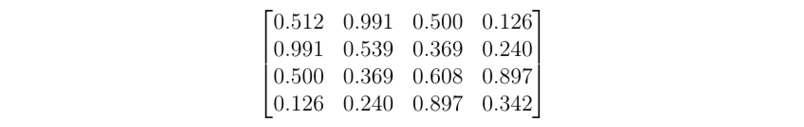

# ndarray-blas-level2

  

BLAS Level 2 operations for [ndarrays](https://github.com/scijs/ndarray)

## Usage

This library implements the basic matrix-vector operations of the Level 2 Basic Linear Algebra Subprograms (BLAS).

Note: It's possible to accomplish the lower triangular functions with the upper triangular version plus flipping and unflipping dimensions, but that's a little convoluted. Instead, the lower triangular versions are suffixed with \_lower just to keep it really simple.

**_See the Terminology section for details about the specific matrices._**

---

### `gemv(alpha, A, x, beta, y)`
Calculate `y <- .alpha*A*x + beta*y` for general matrices.

### `trmv(A, x, isLower)`
Calculate `x <- A*x` for the upper triangular matrix A. Data below the diagonal is ignored. If `isLower` is true, uses the lower triangular portion of A instead.

### `trsv(A, x, isLower)`
Calculate `x <- A^-1 x` for the upper triangular matrix A. Data below the diagonal is ignored.  If `isLower` is true, uses the lower triangular portion of A instead.

### `gbmv(A, kl, ku, x, y, alpha, beta)`
Calculates `y <- alpha*A*x + beta*y` for general banded matrices. `kl` is the number of subdiagonals and `ku` are the number of super diagonals. `alpha` defaults to 1.0 and `beta` defaults to 0.0 if not specified.

### `symv(A, x, y, fromLower, alpha, beta)`
Calculates `y <- alpha*A*x + beta*y` for symmetric matrices. If `fromLower = true`, the function uses the lower triangular part of the matrix; for `false` it uses the upper triangular part. `alpha` defaults to 1.0 and `beta` defaults to 0.0 if not specified.

### `sbmv(A, k, x, y, fromLower, alpha, beta)`
Calculates `y <- alpha*A*x + beta*y` for symmetric banded matrices. `k` is the number of superdiagonals. `alpha` defaults to 1.0 and `beta` defaults to 0.0 if not specified.

## Terminology

### Triangular Matrices

There are 2 types of triangular matrices: lower and upper. The L matrix below is lower triangular and the U matrix below is upper triangular:

### Diagonals and Banded Matrices

A matrix diagonal is a term used to refer to a collection of matrix elements. For any given element, other elements on the same diagonal are on the upper-left and lower-right.

The main diagonal is the diagonal that contains all the elements `A_ij` where `i = j`. The first superdiagonal contains elements where `i + 1 = j`, the second superdiagonal contains those elements where `i + 2 = j`, and so on. The subdiagonals are similar, where the first subdiagonal contains those elements where `i = j + 1` and so on.

Here's an example of a matrix with 2 superdiagonals and 1 subdiagonal:

Matrices with only elements on the main diagonal are called **_diagonal matrices_** and matrices with super- and subdiagonals are called **_banded matrices_**.

### Symmetric and Packed Matrices

These are matrices that are "mirrored" across the main diagonal. An example of a symmetric matrix is shown below:

Since the elements are the same above and below the main diagonal, this matrix can be stored compactly if we just take the unique elements. If we store the upper or lower triangular portions as a linear array, this is called **_packed storage_**.

Packed storage for lower triangular portion:

Packed storage for upper triangular portion:

## Credits
&copy; 2016 Scijs Authors. MIT License.
